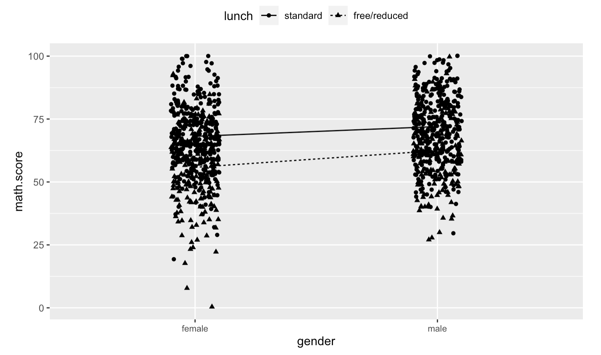
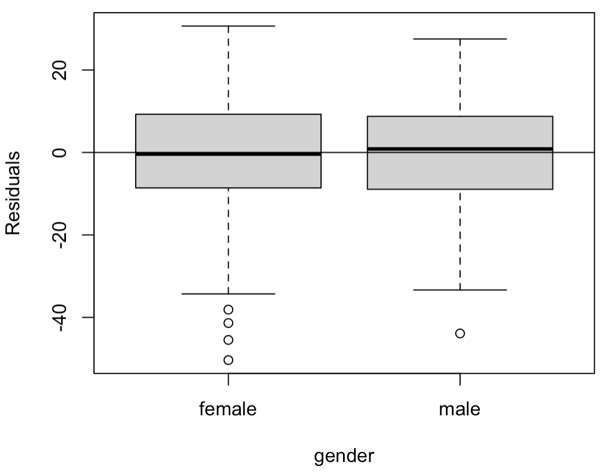

```{r setup, include=FALSE}
knitr::opts_chunk$set(echo = TRUE)
```

\newpage

# Introduction

Tests are an important yet controversial metric of students’ skill sets and academic proficiency. For example, the SAT tests students on their performance in mathematics, reading, and writing, and it can play a significant role in their futures. Students take this exam as they approach the end of high school, and it is often seen as the culmination of their K-12 education, as well as a metric for how prepared they are for a college education. Many universities require that SAT scores be submitted during the application process, and the scores are a significant factor in the process of receiving admittance and financial aid. Having a university education can be a critical factor when seeking job opportunities, and thus one can begin to see the effect one's scores on standardized tests have on people’s lives.\newline

However, many believe that the test scores are neither the most accurate measure of one’s academic capabilities nor unaffected by other external factors such as household income and parental level of education. Due to the weight these scores hold, we intend to shed light on how a student’s background impacts their ability to succeed on tests. The goal of this paper is to use statistical techniques to analyze the ways in which student's backgrounds affect their abilities to succeed on math tests. We expect that our belief will be confirmed and that there are non-academic external factors which contribute to students’ scores on tests.

\newpage

# Methods

We are using data provided to us by our professor (our original dataset proved to be unideal). This data is from a fictional dataset intended for educational purposes. It contains student test scores, as well as their gender, race/ethnicity, parental level of education, qualification for free/reduced lunch, and completion of a test preparation course.

\newpage

# Data Analysis

We created a boxplot, a stripchart, and the summary statistics of every factor. We have shown the stripchart and summary statistics for Free/Reduced lunch below.

```{r, echo=FALSE}

```

```{r, echo=FALSE}

```

From here, we can see that those with standard lunch tend to have higher math test scores than those who with free/reduced lunch. Similar analysis was done on the other factors, and there are at least some levels among each factor which appear to have different average test scores. \newline

We also wanted to check for interaction terms between the different factors. We included an example visual to check for interaction between Gender and Free/Reduced lunch below.

```{r, echo=FALSE}

```

We see that the lines are mostly parallel, and this indicates that there is not a significant interaction term. We saw similar patterns among the other interaction charts. In addition, we compared a model with interaction terms with a model without, and did not find evidence that the interaction terms were statistically significant. \newpage

# Linear Model

Using R to fit an ANOVA model to all the features while excluding interaction terms gives us

$$\widehat{\text{math.score}} = 57.6305 + 4.9953\text{ }\mathbf{1}\{{\text{gender = male}}\} + 2.0408\text{ }\mathbf{1}\{{\text{race.ethnicity = group B}}\}$$
$$+ 2.4700\text{ }\mathbf{1}\{{\text{race.ethnicity = group C}}\} + 5.3410\text{ }\mathbf{1}\{{\text{race.ethnicity = group D}}\}$$
$$+ 10.1347\text{ }\mathbf{1}\{{\text{race.ethnicity = group E}}\} + 1.9661\text{ }\mathbf{1}\{{\text{parental.level.of.education = bachelor's degree}}\}$$
$$- 4.8027\text{ }\mathbf{1}\{{\text{parental.level.of.education = high school}}\} + 2.8884\text{ }\mathbf{1}\{{\text{parental.level.of.education = master's degree}}\}$$
$$- 0.5827\text{ }\mathbf{1}\{{\text{parental.level.of.education = some college}}\} - 4.2487\text{ }\mathbf{1}\{{\text{parental.level.of.education = some high school}}\}$$
$$+ 10.8768\text{ }\mathbf{1}\{{\text{lunch = standard}}\} - 5.4947\text{ }\mathbf{1}\{{\text{test.preparation.course = none}}\}.$$

where $\mathbf{1}$ is the indicator function. \newline

There are numerous noteworthy details here. The expected test score increases by roughly 5 points when the male is gender, increases by almost 11 points when the lunch type is standard, and decreases by about 5.5 points when no test preparation course has been taken. \newline

We tested the significance of gender here. Our hypothesis test was

$$H_0 : \alpha_{\text{GenderMale}} = 0 \text{ }\text{vs.}\text{ } H_a : \alpha_{\text{GenderMale}} \neq 0,$$
which would only be rejected if we found that gender was a statistically significant predictor of math test scores. \newline

For this particular full vs reduced model test, we found an t-statistic of 5.954 with 1000 - 2 = 998 degrees of freedom. The associated p-value was 3.63e-09, which is small enough to always reject the null hypothesis and conclude that gender is a statistically significant predictor of math test scores. \newline

To check diagnostics for this model, we first made a fitted vs residuals plot, shown below.

```{r, echo=FALSE}
knitr::include_graphics("images/diagnostic1.png")
```

Here, we see generally random scatter, but there were some concerns with outliers, specifically for lower residuals. These are also reflected in the next plot, which is an individual boxplot for gender which shows numerous outliers when gender is female. However, constant variance appears to be met given the spread of the boxplot excluding these outliers. \newline

```{r, echo=FALSE}

```

These outliers showed up in general with the other features as well, but overall we observed constant variance across all the different levels for each factor. \newline

We also made a QQ-plot to check for the normality of the errors.

```{r, echo=FALSE}
knitr::include_graphics("images/diagnostic3.png")
```

From this plot, it appears that our residuals have a leftward skew (this is determined by observing the sample quantiles falling beneath the qqline). Within the context of the problem, this does make sense, as our averages from earlier boxplots were higher than scores of 50, but they cannot exceed 100, and this creates a certain "imbalance" which we will have to consider in our conclusions. We can also see that the axes are imbalanced, but it is possible this is due to these outliers.

\newpage

# Full vs Reduced Model

Our model showed weaker test statistics (t-values) and p-values for parental level of education and for race/ethnicity. We chose to explore the significance of these using full vs reduced model hypothesis tests. One of these reduced models was a model without parental level of education. The hypothesis was 

$$H_0 : \alpha_{\text{ParentalLevelOfEducation}} = 0 \text{ }\text{vs.}\text{ } H_a : \alpha_{\text{ParentalLevelOfEducation}} \neq 0,$$

which would only be rejected if we found that parental level of education was a statistically significant predictor of math test scores. \newline

For this particular full vs reduced model test, we found an F-statistic of 7.6388 with 5 degrees of freedom. The associated p-value was 4.689e-07, which is small enough to always reject the null hypothesis and conclude that parental level of education is a statistically significant predictor of math test scores. \newline

Likewise, we found that race/ethnicity was a statistically significant predictor. \newpage

# New Observations

We tested various different new observations on our full model, as well as our model without parental level of education. One new observation we looked into had the following features:

- gender = male
- parental.level.of.education = master's degree
- lunch = standard 
- race.ethnicity = group A
- test.preparation.course = none

Our full model gave us the following:

- 95% confidence interval: $70.89635 \pm 4.52275 = [66.3736, 75.4191]$
- 95% prediction interval: $70.89635 \pm 26.23536 = [44.66099, 97.1317]$

Our reduced model (excluded parental level of education) gave us the following:

- 95% confidence interval: $65.96446 \pm 3.00675 = [62.95771, 68.9712]$
- 95% prediction interval: $65.96446 \pm 26.44272 = [39.52174, 92.40718]$

With our full model, if we were to repeatedly create confidence intervals, we expect that 95% of them will include the actual score of the new observed student. Our prediction interval for this model has a 95% probability of including the actual score of the new observed student. The same conclusions hold for the reduced model, but parental level of education was not included in these models. It is noteworthy that not accounting this feature has led the models to make lower predictions for this new observation. \newpage

# Model Selection

In addition to the full vs reduced model tests we ran before, we also ran both AIC and BIC model selection techniques in order to determine the optimal features to include in our model. The results of these are shown below.

```{r, echo=FALSE}

```
\newline\newline

```{r, echo=FALSE}

```

We can see in both that the optimal model is the one that includes all of the different features. This reflects what we found in our full vs reduced model tests earlier, where we determined that all the factors are significant.

\newpage

# Conclusion

Using our fictional data, we were able to show that a test-taker's gender, race/ethnicity, parental level of education, qualification for free/reduced lunch, and completion of a test preparation course were all statistically significant predictors of the math test scores. \newline

It is important to understand the consequences of these results. For example, gender representation within STEM has been a long-term issue and the outcome is visible within this model, which shows that male test takers are expected to earn 5 more points than female test takers. Likewise, limitations success in STEM based on race and class have been well-documented historically, and are further supported by this model. These are issues on which we must focus more resources and attention in order to create a more equitable society for all to live within. \newline

Future research should pay attention to the ways in which resources are distributed to underserved and underprivileged communities, as well as the ways in which we encourage and discourage our youth from succeeding in math and other like subjects.

\newpage

# Works Cited

`Seshapanpu, Jakki. “Students Performance in Exams.” Kaggle, 9 Nov. 2018,`\newline
`www.kaggle.com/datasets/spscientist/students-performance-in-exams.`
\newline

`Kimmons, Royce. “Exam Scores.” Exam Scores, roycekimmons.com/tools/generated_data/exams.`

\newpage

# Project Code

```{r, eval=FALSE}
scores <- read.csv("./data/StudentsPerformance.csv")
scores <- scores[, -c(7, 8)] # To remove English scores

lmod_full <- lm(math.score ~ ., scores)
lmod_minus_race <- lm(math.score ~ . - race.ethnicity, scores)
anova(lmod_minus_race, lmod_full)

res_lmod_full<-resid(lmod_full)
fit_lmod_full<-fitted(lmod_full)
qqnorm(res_lmod_full)
qqline(res_lmod_full)
plot(fit_lmod_full,res_lmod_full,xlab="Fitted Values",ylab="Residual Values")
abline(h=0)
boxplot(res_lmod_full ~ gender, scores, ylab="Residuals")
abline(h=0)

lmod_minus_parental <- lm(math.score ~ . - parental.level.of.education, scores)
anova(lmod_minus_parental, lmod_full)

library(bestglm)
data2<-scores[1:6]
names(data2)[6] <- "y"
head(data2)
data2$gender <- as.factor(data2$gender)
data2$race.ethnicity <- as.factor(data2$race.ethnicity)
data2$parental.level.of.education <- as.factor(data2$parental.level.of.education)
data2$lunch<- as.factor(data2$lunch)
data2$test.preparation.course<- as.factor(data2$test.preparation.course)
sunit_aic<-bestglm(data2, IC="AIC")
sunit_aic$Subsets
sunit_bic<-bestglm(data2, IC="BIC")
sunit_bic$Subsets

lmod_full <- lm(y ~ ., data2)
summary(lmod_full)

# We changed the different feature values here to explore example results
x0<-data.frame("gender"="male","parental.level.of.education"="master's degree",
               "lunch"="standard","race.ethnicity"="group A", 
               "test.preparation.course"="none")
predict(lmod_full,new=x0,interval="confidence")
predict(lmod_full,new=x0,interval="prediction")
predict(lmod_minus_parental,new=x0,interval="confidence")
predict(lmod_minus_parental,new=x0,interval="prediction")
```